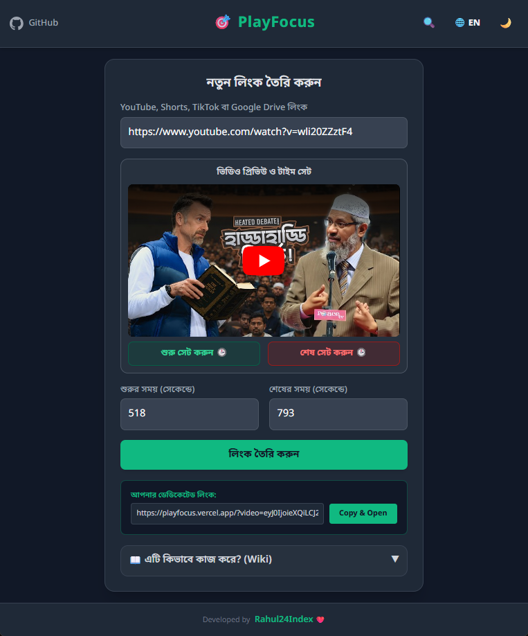
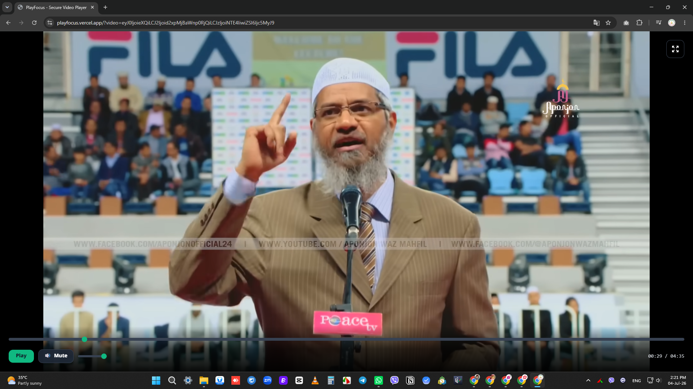
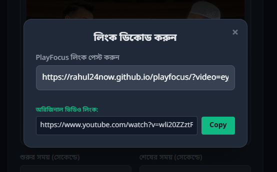
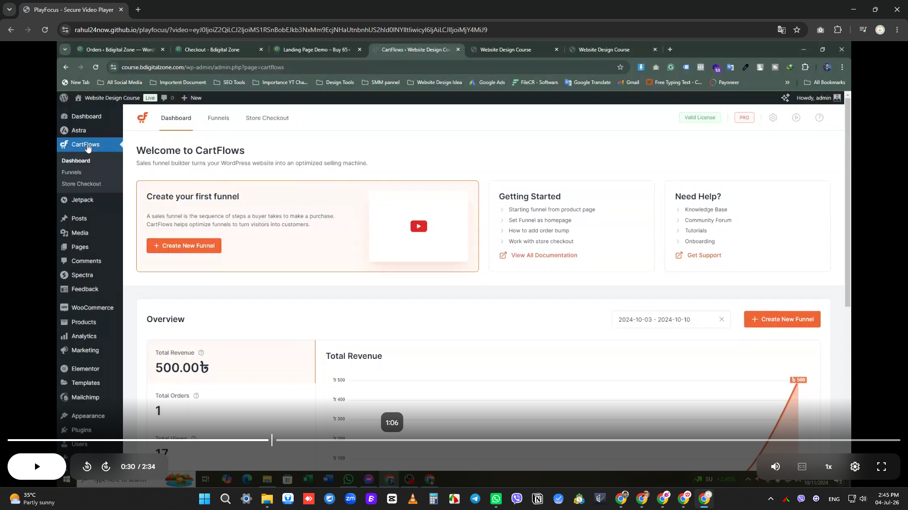

# 🎯 PlayFocus - Secure, Encrypted & Time-Locked Video Player

[English Version Below](#english-version)

PlayFocus হলো একটি আধুনিক, মিনিমালিস্ট এবং ডিস্ট্রাকশন-ফ্রি ওয়েব-ভিত্তিক ভিডিও প্লেয়ার। এর মাধ্যমে আপনি YouTube, YouTube Shorts, TikTok এবং Google Drive ভিডিওর লিংকগুলোকে এনক্রিপ্ট ও নির্দিষ্ট টাইমে লক করে শেয়ার করতে পারবেন, যা ব্যবহারকারীকে কোনো বিজ্ঞাপন বা অনাকাঙ্ক্ষিত রিকমেন্ডেশন ছাড়াই ভিডিও দেখতে সাহায্য করে।

🌐 **লাইভ ডেমো উপভোগ করুন:** [PlayFocus লাইভ লিংক](https://rahul24now.github.io/playfocus)

---

## 💡 কেন এই অ্যাপটি তৈরি করা হয়েছে?

অনেক সময় আমরা শিক্ষামূলক, পেশাদার বা বিনোদনের উদ্দেশ্যে কোনো ভিডিওর একটি নির্দিষ্ট অংশ আমাদের বন্ধুদের বা শিক্ষার্থীদের সাথে শেয়ার করতে চাই। কিন্তু সাধারণ লিংক শেয়ার করলে দর্শকরা যখন মূল প্ল্যাটফর্মে (যেমন ইউটিউব বা টিকটক) যায়, তখন পপ-আপ বিজ্ঞাপন, নোটিফিকেশন, কমেন্ট সেকশন কিংবা প্ল্যাটফর্মের অ্যালগরিদমের সাজেস্ট করা অন্যান্য চটকদার ভিডিওর ফাঁদে পড়ে নিজেদের মূল্যবান সময় ও মনোযোগ হারিয়ে ফেলে। 

এই ডিস্ট্রাকশন বা মনোযোগের বিঘ্ন ঘটার সমস্যাটির স্থায়ী সমাধান করতেই **PlayFocus** তৈরি করা হয়েছে। এটি ভিডিওর লিংকগুলোকে সম্পূর্ণ এনক্রিপ্ট (সুরক্ষিত) করে দেয় এবং একটি ক্লিন ইন্টারফেসে শুধুমাত্র আপনার সেট করা নির্দিষ্ট অংশটুকুই প্রদর্শন করে। ফলে দর্শক বা শিক্ষার্থীদের মনোযোগ শতভাগ ভিডিওর মূল বিষয়ের ওপর বজায় থাকে।

---

## ✨ মূল ফিচারসমূহ

- **🔒 লিংক এনক্রিপশন ও টাইম-লকিং:** YouTube, YouTube Shorts, Google Drive এবং TikTok ভিডিওর লিংকগুলোকে এনক্রিপ্ট করে এবং নির্দিষ্ট সময়সীমা (Start & End Time) লক করে সম্পূর্ণ সিকিউর ডেডিকেটেড লিংক তৈরি করা যায়।
- **🔍 ইন-বিল্ট ডিকোর্ডার টুল:** তৈরি করা যেকোনো PlayFocus এনক্রিপ্টেড লিংক থেকে খুব সহজেই অরিজিনাল ভিডিও লিংকটি আবার ডিকোড (উদ্ধার) করার চমৎকার সুবিধা রয়েছে।
- **📱 টিকটক স্মার্ট স্কেলিং:** টিকটক ভিডিওর জন্য এতে বিশেষ অপটিক্যাল জুম ও মোবাইল সিমুলেশন ট্রিক ব্যবহার করা হয়েছে, যার ফলে ল্যাপটপ বা ডেস্কটপের বড় স্ক্রিনেও টিকটক ভিডিও কোনো সাদা ফাঁকা জায়গা (White Gaps) ছাড়াই নিখুঁতভাবে ফিট হয়ে প্লে হয়।
- **🚫 বিজ্ঞাপন ও ডিস্ট্রাকশন-ফ্রি ইন্টারফেস:** ভিডিওর চারপাশের সব ধরনের সাজেস্টেড ভিডিও, কমেন্ট সেকশন এবং পপ-আপ বিজ্ঞাপন পুরোপুরি হাইড করা থাকে।
- **🌓 ডার্ক ও লাইট মোড (Theme Toggle):** চোখের সুরক্ষার জন্য এক ক্লিকেই ডার্ক এবং লাইট মোডে সুইচ করার সুবিধা।
- **🌐 দ্বৈত ভাষা সাপোর্ট (Dual Language):** সম্পূর্ণ ইন্টারফেসটি বাংলা এবং ইংরেজি—উভয় ভাষায় ব্যবহার করা সম্ভব।
- **🎛️ কাস্টম কন্ট্রোল বার:** প্লে/পজ, মিউট/আনমিউট, ভলিউম স্লাইডার এবং কাস্টম প্রোগ্রেস বার সমৃদ্ধ একটি প্রিমিয়াম কন্ট্রোল ইন্টারফেস (ইউটিউবের জন্য)।

---

## 📸 স্ক্রিনশটসমূহ (Screenshots)

*নিচের গ্রিড টেবিলে আপনার প্রজেক্টের স্ক্রিনশটগুলোর লিংক বসিয়ে নিন:*

| 📱 হোম স্ক্রিন (Home UI) | 🎯 প্লেয়ার ইন্টারফেস (Player View) |
|---|---|
|  |  |
| **🔍 লিংক ডিকোর্ডার (Link Decoder)** | **🎬 টিকটক ফুলস্ক্রিন (TikTok View)** |
|  |  |

---

## 🚀 কিভাবে ব্যবহার করবেন?

1. আপনার কাঙ্ক্ষিত ভিডিওর (YouTube, Shorts, Drive, TikTok) লিংকটি ইনপুট বক্সে পেস্ট করুন।
2. ইউটিউব ভিডিওর ক্ষেত্রে কত সেকেন্ড থেকে শুরু এবং কত সেকেন্ডে শেষ হবে তা নির্ধারণ করুন (ম্যানুয়ালি অথবা প্রিভিউ প্লেয়ার ব্যবহার করে)।
3. **'লিংক তৈরি করুন'** বাটনে ক্লিক করলেই আপনার একটি এনকোডেড ডেডিকেটেড লিংক তৈরি হয়ে ক্লিপবোর্ডে কপি হয়ে যাবে।
4. যেকোনো এনক্রিপ্টেড লিংক থেকে অরিজিনাল লিংক ফিরে পেতে উপরে ডানদিকের সার্চ আইকনে (`🔍`) ক্লিক করে লিংকটি পেস্ট করলেই অরিজিনাল লিংক ডিকোড হয়ে যাবে।

---

## 🛠️ ব্যবহৃত প্রযুক্তি

- **HTML5 & CSS3** (সেমান্টিক এবং রেসপন্সিভ লেআউট স্ট্রাকচার)
- **Tailwind CSS** (আধুনিক, ক্লিন এবং আকর্ষণীয় ইউজার ইন্টারফেস)
- **JavaScript (ES6+)** (ডাইনামিক অপটিক্যাল স্কেলিং, Base64 এনকোডিং/ডিকোর্ডিং এবং স্টেট ম্যানেজমেন্ট)
- **YouTube Iframe Player API** (ভিডিওর নিখুঁত টাইম ট্র্যাকিং, ব্যউন্ডারি লক ও কাস্টম কন্ট্রোল)

---

## ⚖️ সীমাবদ্ধতা

- **টিকটক ও গুগল ড্রাইভ টাইম-লক:** টিকটক এবং গুগল ড্রাইভের নিজস্ব এম্বেড প্লেয়ারের এপিআই (API) পলিসির সীমাবদ্ধতার কারণে এগুলোতে নিখুঁতভাবে কাস্টম স্টার্ট/এন্ড টাইম লক করা যায় না (তবে লিংক সম্পূর্ণ সুরক্ষিত ও ডেস্কটপ ফুলস্ক্রিন ফিট থাকে)। কাস্টম টাইম-লক ফিচারটি শুধুমাত্র ইউটিউব ভিডিও এবং শর্টসের জন্য প্রযোজ্য।
- **কপিরাইটযুক্ত ভিডিও:** ইউটিউবের কিছু নির্দিষ্ট মিউজিক ভিডিও বা বয়স-সীমাবদ্ধ (Age-Restricted) ভিডিও যা থার্ড-পার্টি ওয়েবসাইটে প্লে করার অনুমতি নেই, সেগুলো এখানে প্লে নাও হতে পারে।

---

## 👨‍💻 ডেভলপার

Developed with ❤️ by [Rahul24Index](https://linktr.ee/rahul24index) Feel free to use, share, and contribute to this project!

---
 

<h1 id="english-version">🎯 PlayFocus - Secure, Encrypted & Time-Locked Video Player (English)</h1>

PlayFocus is a modern, minimalist, and distraction-free web-based video player. It allows you to encrypt and time-lock video links from YouTube, YouTube Shorts, TikTok, and Google Drive, enabling users to watch videos without any annoying ads or unwanted recommendations.

🌐 **Experience the Live Demo:** [PlayFocus Live Link](https://rahul24now.github.io/playfocus)

---

## 💡 Why Was This App Created?

Often, we want to share a specific portion of a video for educational, professional, or entertainment purposes. However, when viewers open standard links on original platforms (like YouTube or TikTok), they easily fall prey to pop-up ads, endless comment sections, notifications, or algorithm-driven recommendation loops, wasting their valuable time and focus.

**PlayFocus** was built to provide a permanent solution to this digital distraction. It completely encrypts video links and displays only the designated time-locked portion in a pristine, clean layout. This keeps the viewer's attention 100% anchored to the video content itself.

---

## ✨ Key Features

- **🔒 Link Encryption & Time-Locking:** Easily encrypt and time-lock (set specific Start & End boundaries) for YouTube, YouTube Shorts, Google Drive, and TikTok videos into a secured dedicated link.
- **🔍 In-Built Decoder Tool:** A built-in decoder utility allows you to seamlessly recover and decode the original video URL back from any generated PlayFocus encrypted link.
- **📱 TikTok Smart Scaling:** Implements a custom optical zoom and mobile simulation layer for TikTok embeds, making vertical videos fit flawlessly on large desktop screens without any ugly white side-gaps.
- **🚫 Ad & Distraction-Free Interface:** Entirely strips away video recommendations, comments, and sidebars to build a 100% focused environment.
- **🌓 Dark & Light Themes:** Toggle between dark and light appearance states with a single click for enhanced eye comfort.
- **🌐 Dual Language UI:** Offers instant localized translation switching between English and Bengali.
- **🎛️ Custom Control Suite:** A bespoke video player controller encompassing play/pause states, mute/unmute functions, a precise volume slider, and an interactive progress bar (optimized for YouTube).

---

## 📸 Screenshots

*Replace the image placeholders in the table below with your repository screenshot paths:*

| 📱 Home UI | 🎯 Player View |
|---|---|
|  |  |
| **🔍 Link Decoder** | **🎬 TikTok Fullscreen** |
|  |  |

---

## 🚀 How to Use?

1. Paste your desired video URL (YouTube, Shorts, Drive, TikTok) into the main input box.
2. For YouTube links, define the start and end seconds manually or utilize the visual preview timeline.
3. Click the **'Generate Link'** button to encrypt and produce your dedicated URL, which will automatically copy to your clipboard.
4. To reverse the process, click the search/decode icon (`🔍`) on the top right, paste the PlayFocus link, and fetch the original source URL.

---

## 🛠️ Technologies Used

- **HTML5 & CSS3** (Semantic and mobile-responsive layout mapping)
- **Tailwind CSS** (Modern, clean, and highly aesthetic interface components)
- **JavaScript (ES6+)** (Dynamic viewport scaling ratios, Base64 link encoding/decoding, and interactive state logic)
- **YouTube Iframe Player API** (Precise runtime tracking, interval locking, and independent custom audio/video controls)

---

## ⚖️ Limitations

- **TikTok & Google Drive Boundaries:** Due to the structural API constraints of TikTok and Google Drive iframe wrappers, custom start and end times cannot be hard-locked (the links remain fully encrypted and auto-scaled, however). The precise time-locking functionality is uniquely tailored for YouTube and YouTube Shorts.
- **Copyrighted Media Restrictions:** Certain music videos, premium content, or age-restricted (18+) clips on YouTube that forbid third-party embedding may fail to load within custom iframes.

---

## 👨‍💻 Developer

Developed with ❤️ by [Rahul24Index](https://linktr.ee/rahul24index) Feel free to use, share, and contribute to this project!
